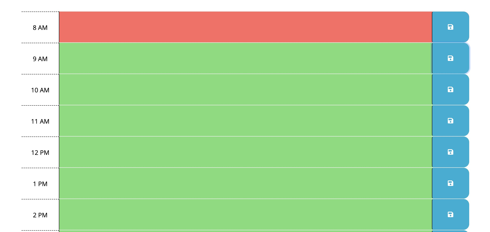
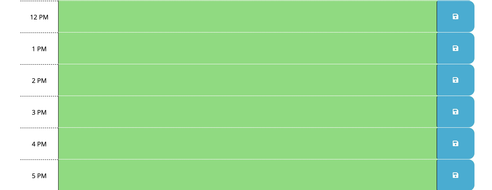

# make-arrangements

## Description

    Make-arrangements is a work day scheduler you can use each day to make your days less hectic. Add your activites, work meetings, etc., so you can have a strategic day! 

## Technologies
<ul>
    <li> HTML
    <li> JavaScript
    <li> CSS
    <li> Bootstrap
</ul>

## Screenshots

## Link
[make-arrangements](https://megansilva.github.io/make-arrangements/)
